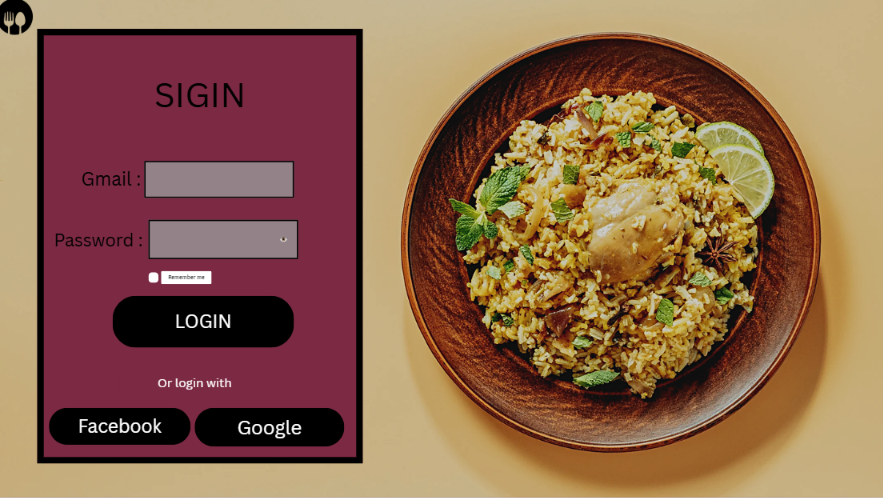
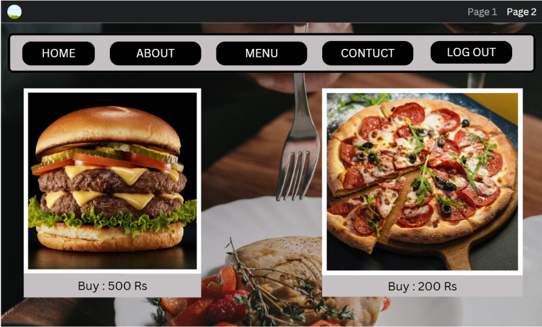

# UI-UX-Experiment1

## Aim:
To understand the difference between User Interface (UI) and User Experience (UX) through observation and comparison

## Materials Required
•	Laptop/Mobile phone 
•	Internet connection 
•	Paper and pen (or worksheet) 
•	Popular apps/websites (Amazon, Flipkart, Swiggy, WhatsApp, Instagram, etc.) 

## Algorithm:

Step 1: Select any two mobile applications or websites.
Example:
•	Amazon vs Flipkart 
•	Swiggy vs Zomato 
•	Gmail vs Outlook 
Step 2: Perform the following tasks:
•	Open the application 
•	Search for an item 
•	Add to cart (or perform a simple task) 
•	Navigate through menus 
Step 3: Observe UI features:
•	Colors 
•	Typography 
•	Icons 
•	Buttons 
•	Layout 
•	Images 
Step 4: Observe UX features:
•	Ease of navigation 
•	Speed of completing the task 
•	Number of clicks 
•	User satisfaction 
•	Error handling 
Step 5: Complete a comparison table.
Feature	App A	App B
UI Design		
Navigation		
Ease of Use		
Visual Appeal		
Overall UX		

## Output:

## Result:

The hands-on UI experiments have been successfully implemented.